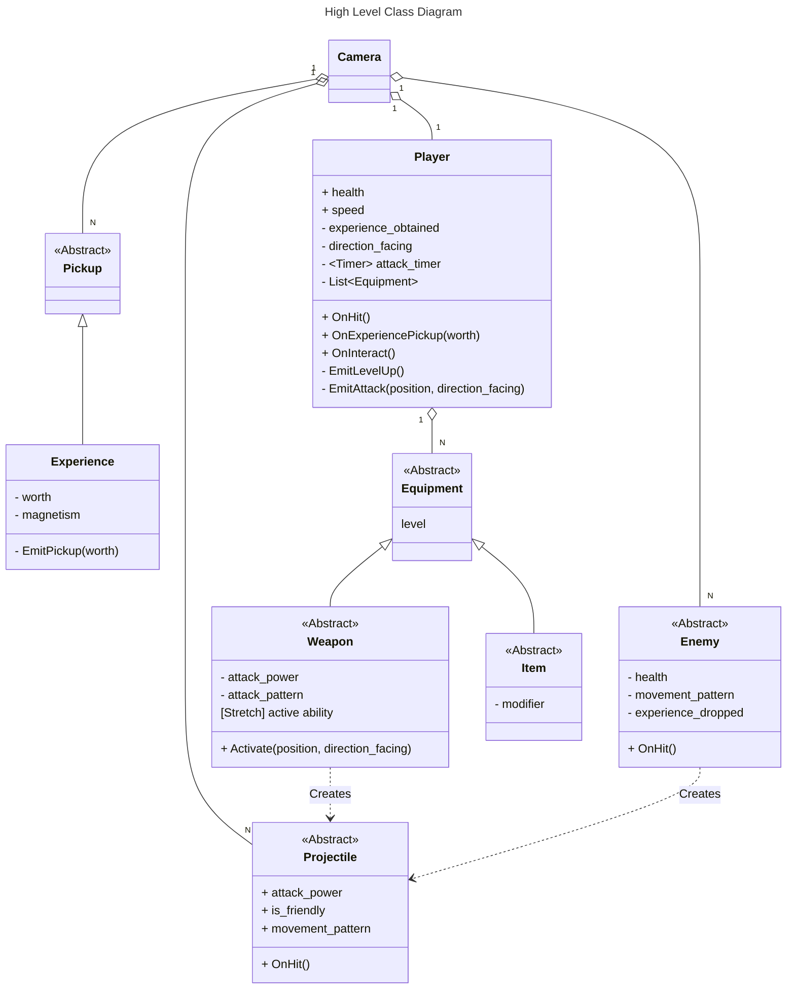

```mermaid
---
title: High Level Class Diagram
---
classDiagram
  class Camera {
  }

  class Player {
    + health
    + speed
    - experience_obtained
    - direction_facing
    - ~Timer~ attack_timer
    - List~Equipment~

    + OnHit()
    + OnExperiencePickup(worth)
    + OnInteract()
    - EmitLevelUp()
    - EmitAttack(position, direction_facing)
  }

  class Enemy {
    <<Abstract>>
    - health
    - movement_pattern
    - experience_dropped

    + OnHit()
  }

  class Pickup {
    <<Abstract>>
  }


  class Experience {
    - worth
    - magnetism
    - EmitPickup(worth)
  }

  Pickup <|-- Experience

  class Equipment {
    <<Abstract>>
    level
  }

  Equipment <|-- Weapon
  Equipment <|-- Item

  class Weapon {
    <<Abstract>>
    - attack_power
    - attack_pattern
    [Stretch] active ability

    + Activate(position, direction_facing)
  }

  class Item {
    <<Abstract>>
    - modifier
  }

  class Projectile {
    <<Abstract>>
    + attack_power
    + is_friendly
    + movement_pattern
    + OnHit()
  }

  %% Relationships
  Camera "1" o-- "1" Player
  Camera "1" o-- "N" Projectile
  Camera "1" o-- "N" Enemy
  Camera "1" o-- "N" Pickup
  Player "1" o-- "N" Equipment
  Weapon ..> Projectile : Creates
  Enemy ..> Projectile : Creates
```

```mermaid
sequenceDiagram
```